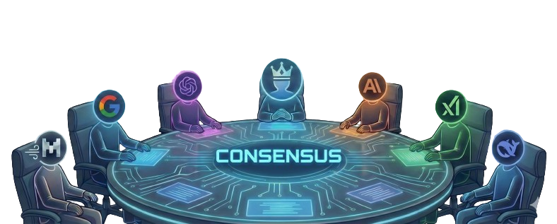

<div align="center">

# FactNews

### **Consensus-Driven News Verification System**

*Fighting misinformation through AI-powered multi-source analysis*




</div>

---

## The Problem

### The Misinformation Crisis

In an era of information overload, distinguishing fact from fiction has become increasingly difficult:

- **Media Bias**: Every outlet has its own perspective, leading to selective reporting
- **Echo Chambers**: Algorithms feed us content that confirms our existing beliefs
- **Clickbait Culture**: Sensational headlines prioritize engagement over accuracy
- **No Single Source of Truth**: Different outlets report the same event with conflicting details
- **Manual Fact-Checking is Slow**: Traditional fact-checking can't keep pace with the 24/7 news cycle

**Result**: Readers are left confused, misinformed, or trapped in filter bubbles.

---

## Our Solution

### FactNews: Your AI-Powered News Consensus Engine

FactNews is an advanced analytical platform that **cross-verifies news information across multiple global media outlets**. By employing a **council of Large Language Models (LLMs)** and **Retrieval-Augmented Generation (RAG)**, we identify consensus, highlight contested facts, and provide transparent, evidence-based summaries of current events.

### Core Philosophy

| Pillar | Description |
|--------|-------------|
| **Multi-Source Verification** | No single source is treated as definitive. We aggregate from 20+ international outlets. |
| **Consensus Identification** | Mathematical and semantic analysis calculates agreement between reports. |
| **Transparent Sourcing** | Every claim links to its original source for independent verification. |

---

## Key Features

### 1. Multi-Source News Aggregation
Automated ingestion from **20+ major news outlets** via RSS feeds:
- **International**: BBC, Reuters, Al Jazeera, DW, France24
- **US**: CNN, Fox News, New York Times, Washington Post, Wall Street Journal
- **Tech**: TechCrunch, Wired, The Verge
- **And more...**

### 2. AI Model Council
Multiple LLMs deliberate in parallel, then a judge synthesizes their conclusions:
- Supports **OpenAI, Anthropic, Google, DeepSeek, Grok, Cerebras**, and more
- Reduces individual model bias through consensus
- Judge LLM produces balanced, well-reasoned synthesis

### 3. Retrieval-Augmented Generation (RAG)
- Optimized chunk-level semantic search
- Multi-tiered embedding cache (Redis + local NPZ + API fallback)
- Fast numpy vector operations without heavy vector databases

### 4. Bias & Divergence Analysis
- Identifies where sources **agree** vs **disagree**
- Highlights potential media bias
- Shows contested facts with supporting evidence from each source

### 5. AI-Powered Newspaper
- Daily AI-generated newspaper edition
- Curated stories with consensus analysis
- Topic clustering for organized reading

### 6. ConsentAI Arena
- Compare responses from multiple AI models side-by-side
- See how different models interpret the same news
- Understand model-specific biases

---

## How It Works

```
┌─────────────────────────────────────────────────────────────────────────────┐
│                           FACTNEWS PIPELINE                                  │
└─────────────────────────────────────────────────────────────────────────────┘

  ┌──────────────┐     ┌──────────────┐     ┌──────────────┐
  │  RSS Feeds   │────▶│   Scraper    │────▶│   Chunker    │
  │  (20+ srcs)  │     │  (Articles)  │     │  (Segments)  │
  └──────────────┘     └──────────────┘     └──────────────┘
                                                    │
                                                    ▼
  ┌──────────────┐     ┌──────────────┐     ┌──────────────┐
  │   Response   │◀────│    Model     │◀────│   Embedding  │
  │     Cache    │     │   Council    │     │    Cache     │
  └──────────────┘     └──────────────┘     └──────────────┘
         │                    │                    ▲
         │                    ▼                    │
         │             ┌──────────────┐            │
         │             │    Judge     │            │
         │             │     LLM      │            │
         │             └──────────────┘            │
         │                    │                    │
         ▼                    ▼                    │
  ┌──────────────┐     ┌──────────────┐     ┌──────────────┐
  │   Frontend   │◀────│  Consensus   │◀────│  RAG Query   │
  │   (Next.js)  │     │   Report     │     │   Engine     │
  └──────────────┘     └──────────────┘     └──────────────┘

```

### The Consensus Process

1. **Ingest**: RSS feeds pull articles from 20+ sources continuously
2. **Process**: Articles are chunked, embedded, and stored with metadata
3. **Query**: User asks a question about current events
4. **Retrieve**: RAG engine finds relevant chunks across all sources
5. **Deliberate**: Multiple LLMs analyze the evidence in parallel
6. **Judge**: A judge LLM synthesizes findings into a consensus report
7. **Present**: User sees consensus, divergences, and original sources

---

## Technical Architecture

### Backend (FastAPI + Python)

```
backend/
├── app.py                    # FastAPI routes & endpoints
├── rag_optimized.py          # ChunkRAG with multi-tier cache
├── embedding_cache.py        # Redis embedding store
├── response_cache.py         # L1/L2 response caching
├── cache.py                  # Redis connection utility
├── lru_cache.py              # In-memory LRU cache
├── chunker.py                # News chunking logic
├── rss_ingester.py           # RSS feed ingestion
├── scraper.py                # Web scraping utilities
├── sources_catalog.py        # Source catalog by country
├── pulse.py                  # AI Pulse arena logic
├── ai_newspaper.py           # Newspaper edition generator
├── clustering.py             # Article clustering
│
└── inference/                # Multi-provider LLM layer
    ├── __init__.py           # get_provider, ModelCouncil
    ├── factory.py            # Provider factory
    ├── config.py             # Provider configurations
    ├── base.py               # InferenceProvider base
    ├── council.py            # ModelCouncil: N + 1 judge
    └── providers/            # Provider integrations
        ├── openai_provider.py
        ├── anthropic.py
        ├── deepseek.py
        ├── google.py
        ├── grok.py
        ├── cerebras.py
        ├── zai.py
        ├── openrouter.py
        └── crusoe.py
```

### Frontend (Next.js + React)

```
frontend/
├── app/                      # Next.js App Router
│   ├── arena/                # AI model comparison
│   ├── bookmarks/            # Saved reports
│   ├── feed/                 # News feed
│   ├── history/              # Search history
│   ├── search/               # Main search interface
│   ├── sources/              # News sources browser
│   └── trending/             # Trending topics
├── components/               # React components
├── hooks/                    # Custom React hooks
├── lib/                      # Utilities, API client
└── stores/                   # Zustand state management
```

### Tech Stack

| Layer | Technologies |
|-------|-------------|
| **Frontend** | Next.js 16, React 19, TypeScript, Tailwind CSS 4, Zustand |
| **Backend** | FastAPI, Python 3.11+, Uvicorn |
| **AI/ML** | OpenAI, Anthropic, Google, DeepSeek, Grok, Cerebras |
| **Caching** | Redis, File-based NPZ cache, LRU in-memory |
| **Processing** | NumPy, scikit-learn, newspaper3k, trafilatura |
| **Data** | RSS feeds, Supabase (pgvector optional) |

---

## API Endpoints

| Method | Endpoint | Description |
|--------|----------|-------------|
| `GET` | `/` | Status + active providers |
| `GET` | `/stats` | Article and embedding counts |
| `GET` | `/health` | Health check (Redis, RAG status) |
| `POST` | `/ask` | Generate consensus fact-check |
| `POST` | `/ask/search` | Fast chunk search without AI |
| `POST` | `/ask/stream` | SSE streaming generation |
| `GET` | `/articles` | List articles with pagination |
| `GET` | `/sources/catalog` | All sources by country |
| `GET/PUT` | `/sources/selected` | Manage source selection |
| `POST` | `/refresh-news` | Re-ingest RSS feeds |
| `POST` | `/api/ai-pulse` | Multi-agent arena debate |
| `GET` | `/api/newspaper` | AI-generated newspaper |

---

## Getting Started

### Prerequisites

- Python 3.11+
- Node.js 18+
- Redis (optional, for enhanced caching)
- API keys for LLM providers

### Backend Setup

```bash
# Navigate to backend
cd backend

# Create virtual environment
python3 -m venv env
source env/bin/activate  # Linux/Mac
# env\Scripts\activate   # Windows

# Install dependencies
pip install -r requirements.txt

# Create .env file
cat > .env << EOF
OPENAI_API_KEY=your_key_here
CRUSOE_API_KEY=your_key_here
REDIS_URL=redis://localhost:6379
COUNCIL_PROVIDERS=openai,deepseek,anthropic
EOF

# Start server
uvicorn app:app --reload --port 8000
```

### Frontend Setup

```bash
# Navigate to frontend
cd frontend

# Install dependencies
npm install

# Create .env.local
echo "NEXT_PUBLIC_API_URL=http://localhost:8000" > .env.local

# Start development server
npm run dev
```

Visit **http://localhost:3000** to see the app.

---

## Architecture Highlights

### 1. Optimized Chunk-level RAG
- **Multi-tiered embedding cache**: Redis → local NPZ → OpenAI API
- **Fast vector operations**: NumPy-based similarity search without heavy Vector DB
- **Cross-process safety**: FileLock for concurrent NPZ writes

### 2. Model Council Pattern
```python
from inference import ModelCouncil

council = ModelCouncil(
    providers=["openai", "deepseek", "grok"],
    judge="anthropic"
)

result = council.deliberate("Analyze this news story")
print(result["judgment"]["synthesis"])
```

### 3. Graceful Degradation
- Works without Redis (falls back to local cache)
- Council deliberation continues if individual providers fail
- Automatic retry with rate-limit handling

---

## Why FactNews Matters

### For News Readers
- **Cut through the noise**: Get balanced summaries from multiple sources
- **See the full picture**: Understand where sources agree and disagree
- **Verify independently**: Every claim links to original sources

### For Researchers
- **Study media bias**: Analyze how different outlets frame stories
- **Track narrative evolution**: See how coverage changes over time
- **Access structured data**: Programmatic API for analysis

### For Democracy
- **Combat misinformation**: Evidence-based consensus over viral claims
- **Promote transparency**: Open methodology, verifiable sources
- **Encourage critical thinking**: Show multiple perspectives, let users decide

---

## Roadmap

| Phase | Status | Description |
|-------|--------|-------------|
| Phase 1 | Completed | Core backend architecture & basic frontend |
| Phase 2 | Completed | Single-model LLM integration & embeddings |
| Phase 3 | Completed | RSS ingestion & article scraping |
| Phase 4 | In Progress | Vector database migration (Supabase pgvector) |
| Phase 5 | In Progress | Multi-LLM consensus council |
| Phase 6 | Planned | Advanced UI for consensus/divergence visualization |
| Phase 7 | Planned | Browser extension for in-page fact-checking |
| Phase 8 | Planned | Mobile app with push notifications |

---

## Contributing

We welcome contributions! Please see our contributing guidelines for details on:

- Code of conduct
- Pull request process
- Coding standards
- Testing requirements

---

## License

This project is licensed under the **MIT License** - see the [LICENSE](LICENSE) file for details.

---

## Acknowledgments

- News outlets providing RSS feeds for public access
- OpenAI, Anthropic, Google, DeepSeek, and other LLM providers
- Open source community for the amazing tools that power this project

---

<div align="center">

**Built with purpose during HackEurpoe 2026**

*"In a world of noise, find the consensus."*

[Get Started](#getting-started) · [API Docs](#api-endpoints) · [Architecture](#technical-architecture)

</div>
